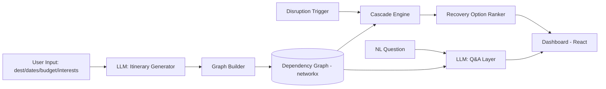

# TravelPilot — PRD, TRD & Project Flow
**HerSpark Ideathon · Sept 19–20, 2026 · 48-hour build**

> Scoring weights this doc is built around: AI Integration 25% · LinkedIn content 25% · Prototype & UX 20% · Problem understanding 15% · Innovation 15%

---

## 0. Why This Idea, And What Changes From the Original Plan

TravelPilot is chosen over HireFlow/ContractLens because it's the only one of the three where the hard design work — the itinerary dependency graph and cascade-scoring logic — is already drafted in TripRescue. That's a real time advantage, but it's a *conditional* one, not a guaranteed one. This doc bakes in the fixes flagged in review:

1. **Reuse-risk gate added as literally the first task of Day 1** — don't assume TripRescue's code drops in cleanly; verify before committing the schedule to it.
2. **LinkedIn content is now scheduled across both days**, not batched at the end — it's worth as much as AI Integration and was previously an end-of-sprint afterthought.
3. **A dedicated demo rehearsal slot** exists before the final polish pass, because the live "graph turns red" moment is the single point of failure for the whole pitch.
4. **HireFlow is kept as a named fallback**, not just a discarded option — its traceability feature is simple enough to rebuild fast if TravelPilot's graph work stalls.

---

# PART 1 — PRODUCT REQUIREMENTS DOCUMENT (PRD)

## 1.1 Problem Statement
Planning a trip means juggling transport, stays, activities, budget, and schedule as one interconnected system — but real trips break constantly (delays, cancellations, weather, sold-out venues). Existing travel tools manage individual bookings well but don't reason across the *whole* itinerary when one piece changes, leaving travelers to manually figure out what else is now affected.

## 1.2 Product Goal
Build an AI agent that treats a trip as a connected system — not a list of bookings — so that when one piece breaks, the system immediately knows what else it touches, ranks recovery options, and lets the traveler ask natural-language questions about the impact.

## 1.3 Success Metrics (for this hackathon specifically)
| Metric | Target |
|---|---|
| Live disruption demo works without failure | Rehearsed ≥3x before submission |
| Judges can see AI reasoning, not just AI output | Show ranked recovery options + reasoning, not a single answer |
| Problem understanding is explicit | Open with the "tools handle bookings, not itineraries" framing verbatim |
| LinkedIn presence | ≥1 post Day 1, ≥1 post Day 2 pre-submission, documenting real progress not just a reveal |

## 1.4 Target User / Persona
**Priya, 27, plans a 6-day Ladakh trip.** Mid-trip, her connecting flight is delayed 5 hours. She doesn't just need a new flight time — she needs to know her transfer, her first day's activity booking, and her hotel check-in are all now at risk, and what her best recovery options are, fast, without manually re-checking every booking.

## 1.5 Scope

### MVP (must ship)
- Destination, dates, budget, interests → generated day-by-day itinerary
- Itinerary modeled as a dependency graph (flights → transfers → activities → stays)
- **Live disruption injection demo**: trigger a delay, watch it cascade through the graph, affected nodes highlighted
- Ranked recovery options generated from cascade-scoring logic
- Natural-language Q&A ("what happens to my itinerary if this is cancelled?")
- Final trip dashboard: itinerary, transport, costs, timings, backup options

### Stretch (only if MVP is stable with time to spare)
- Budget re-optimizer after a disruption
- Drag-to-reorder itinerary editing
- Mock live weather/availability feed to auto-trigger disruptions

### Explicitly Out of Scope
- Real payment/booking integration (mocked data only)
- Multi-user/collaborative trip planning
- Mobile app (web only for the hackathon)

## 1.6 Core User Stories
1. *As a traveler*, I enter my destination, dates, budget, and interests, and get a day-by-day itinerary.
2. *As a traveler mid-trip*, I trigger (or the system detects) a disruption, and I immediately see every part of my trip it affects.
3. *As a traveler*, I get 2–3 ranked recovery options with a clear reason each is ranked where it is.
4. *As a traveler*, I can ask "what happens if X is cancelled?" in plain language and get a direct answer grounded in my actual itinerary.
5. *As a judge watching the demo*, I can see the reasoning process (which nodes lit up, why this recovery option ranked first), not just a final answer.

## 1.7 Functional Requirements
- FR1: Generate an itinerary from destination/dates/budget/interests via LLM
- FR2: Represent itinerary as a dependency graph (nodes = bookings/activities, edges = dependencies)
- FR3: Detect and propagate cascading impact when a node is disrupted
- FR4: Rank recovery options using the cascade-scoring algorithm
- FR5: Answer natural-language questions grounded in the live graph state
- FR6: Render a dashboard summarizing itinerary, costs, timings, and backups

## 1.8 Non-Functional Requirements
- Demo reliability > feature count — the live disruption trigger must work every time, offline-safe (no dependency on a real external API mid-demo)
- Response latency for Q&A and recovery ranking should feel "live" in a demo (target <5s)
- UI must clearly visualize graph state changes (color/animation), not just text output

---

# PART 2 — TECHNICAL REQUIREMENTS DOCUMENT (TRD)

## 2.1 Tech Stack
| Layer | Choice | Notes |
|---|---|---|
| Frontend | React | Itinerary dashboard + graph visualization |
| Graph viz | react-force-graph or vis.js | Pick whichever renders "node turns red" fastest to implement |
| Backend | FastAPI | Itinerary generation, graph logic, Q&A endpoint |
| Graph model | networkx (Python) | Carried over from TripRescue TRD |
| LLM | Any available API (itinerary generation + NL Q&A) | Keep prompts swappable — don't hardcode to one provider mid-build |
| Data | In-memory / JSON, no DB needed | Hackathon scope — persistence isn't scored |

## 2.2 System Architecture

## 2.3 Data Model (Dependency Graph)
- **Node types**: `flight`, `transfer`, `activity`, `stay`
- **Node attributes**: `id`, `type`, `start_time`, `end_time`, `location`, `cost`, `status` (`ok` / `at_risk` / `broken`)
- **Edge types**: `depends_on` (e.g., activity depends_on transfer depends_on flight)
- **Edge attributes**: `buffer_time` (minutes of slack before dependency breaks)

## 2.4 Core Algorithm — Cascade Detection
1. On disruption of node `N` (e.g., flight delayed 5h), walk all nodes reachable via `depends_on` edges from `N`.
2. For each reachable node, compare the new arrival/availability time against its `buffer_time`.
3. Mark node `at_risk` if buffer is exceeded, `broken` if the dependency is now impossible.
4. Return the full affected subgraph for frontend highlighting.

## 2.5 Core Algorithm — Recovery Ranking (Cascade Scoring)
Score each candidate recovery option by:
- **Time recovered** (how much of the original schedule is preserved)
- **Cost delta** (cheaper = higher score)
- **Number of downstream nodes still affected** (fewer = higher score)

Return top 2–3 ranked options with the score reasoning surfaced in the UI (this reasoning-visible piece is what should carry the AI Integration score).

## 2.6 API Endpoints (FastAPI)
| Method | Endpoint | Purpose |
|---|---|---|
| POST | `/itinerary/generate` | Create itinerary from user inputs |
| POST | `/disruption/trigger` | Simulate a disruption on a given node |
| GET | `/disruption/cascade/{node_id}` | Get affected subgraph |
| GET | `/recovery/options/{node_id}` | Get ranked recovery options |
| POST | `/qa` | Natural-language question over current graph state |

## 2.7 Mocked / Faked for Time
- Weather/availability feed: **mocked with a static dataset** — do not build a real integration (per review: not worth engineering time for demo purposes)
- Payment/booking: **not implemented** — all bookings are simulated data

## 2.8 Technical Risks & Mitigations
| Risk | Mitigation |
|---|---|
| TripRescue code doesn't drop in cleanly | **Gate check first thing Day 1 AM** (see Project Flow) — if it fails, fall back to rebuilding a minimal graph model fresh; don't lose more than 2 hours discovering this |
| Live demo glitches in front of judges | Dedicated rehearsal slot Day 2 (≥3 run-throughs) before final polish |
| Graph visualization is harder to get "pretty" than expected | Prioritize function over animation polish — a graph that correctly turns red beats a beautifully animated one that doesn't |
| LLM latency makes Q&A feel slow live | Pre-cache/pre-run the exact demo questions before presenting; don't rely on live LLM calls for the rehearsed demo moment |

---

# PART 3 — PROJECT FLOW (48-Hour Build Sequence)

## Day 1

| Time | Task |
|---|---|
| **AM (first 30 min)** | **Reuse-risk gate**: attempt to drop TripRescue's graph/cascade code into a fresh repo and run it. If it fails cleanly within 30 min → **decision point**: proceed with adapted reuse, or pivot to rebuilding the graph model fresh with the same design (still faster than designing from scratch) |
| **AM (remainder)** | Kickoff, scope PRD down to hackathon size, finalize repo + stack |
| **Midday** | Backend: itinerary generation (LLM) + dependency graph model |
| **Early evening** | Cascade detection logic on a manually triggered disruption |
| **Evening** | **LinkedIn Post #1** — "here's the problem we're solving" teaser, posted before going heads-down |
| **Night** | Frontend skeleton: itinerary dashboard shell |

## Day 2

| Time | Task |
|---|---|
| **AM** | Recovery-option ranking logic + NL Q&A interface |
| **Midday** | Wire up the live disruption demo end-to-end (trigger → cascade → highlight → ranked options) |
| **Early afternoon** | **Demo rehearsal slot** — run the full disruption demo ≥3 times, fix anything that breaks. This is non-negotiable before touching UI polish. |
| **Late afternoon** | UI polish pass (only after the demo is reliable) |
| **Early evening** | **LinkedIn Post #2** — real progress shot (e.g., a screenshot of the graph mid-cascade), posted before the final rush |
| **Evening** | Record final demo video, finalize submission |

## Fallback Plan
If the graph/cascade work is meaningfully behind schedule by **Day 2 midday**, pivot to **HireFlow's traceability feature** (source-linked extraction) as a lower-risk, faster-to-finish submission — it was scoped as the next-best option specifically because it's simpler to guarantee working by deadline.

## Submission Checklist
- [ ] Live disruption demo rehearsed and reliable
- [ ] Dashboard shows itinerary, costs, timings, and backup options
- [ ] Reasoning behind ranked recovery options is visible in UI, not hidden
- [ ] LinkedIn Post #1 (Day 1) published
- [ ] LinkedIn Post #2 (Day 2) published
- [ ] Demo video recorded
- [ ] Final submission includes problem framing verbatim ("tools handle bookings, not itineraries")
